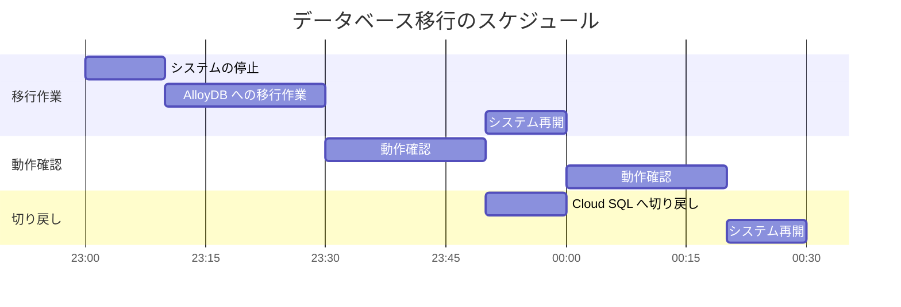
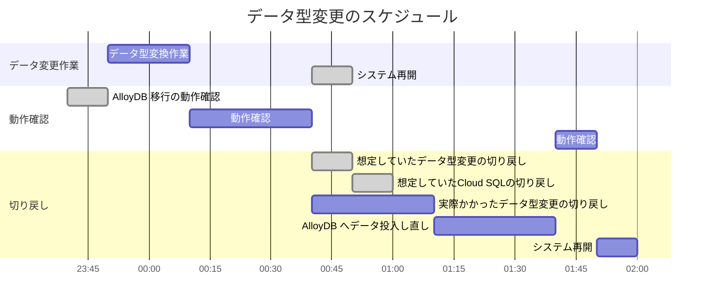

## はじめに
担当しているプロダクトでは，DB（PostgreSQL）として Google Cloud の Cloud SQL が使われていました．前々から DB 周りのパフォーマンスを上げたい話があり，より優れているサービスである [Google Cloud の AlloyDB](https://cloud.google.com/products/alloydb?hl=en) へのデータベース移行をやらせていただくことになりました．データの移行をやったことがない状態から，実際に取り組んでみて学んだこと・振り返りなどを記録します．

## 移行方法の検討
Cloud SQL から AlloyDB へデータベースを移行するのにあたりまずはどの方法で実施するのかを調査し，以下の 3 つの方法を検討しました．

1. [CSV](https://cloud.google.com/alloydb/docs/export-csv-file) や [dump](https://cloud.google.com/alloydb/docs/export-dmp-file) ファイルを利用する方法
2. [Cloud SQL のバックアップを利用する](https://cloud.google.com/alloydb/docs/migrate-cloud-sql-to-alloydb)方法
3. [Database Migration Service を利用する](https://cloud.google.com/database-migration/docs/postgresql-to-alloydb/quickstart)方法

2 と 3 番目の方法はそれぞれ Google Cloud のコンソールの操作で移行が行える方法ですが，前者は様々な制限（PostgreSQL のバージョン，移行可能なデータ容量，バックアップデータしか扱えないことなど）があり，後者は様々な事前設定（接続プロファイルの設定，移行ジョブの作成，AlloyDB のプロモーションなど）が必要でした．

結論としては，ダウンタイムを取る前提で，通常のファイルを扱いデータのエクスポートとインポート操作のみで実現でき，前準備や学習コストが相対的にかからなさそうな 1 番目の方法を採用しました．

```bash
# plain フォーマットでダンプファイルを作成
# --no-owner でオブジェクトの所有権を ALTER OWNER させないようにする
# --no-acl でデータベースに対するアクセス権限自体をダンプ対象外にする
$ pg_dump -h $PSQL_HOST -U $PSQL_USER -d $PSQL_DB \
--format=plain --no-owner --on-acl > backup.sql
```

> DB への接続は Compute Engine を利用した踏み台サーバーを経由している構成のため，データのファイルはそのサーバー上に一時的に置くようにしました．
>
> 

## 移行に関する検証
データベース移行を本番環境で実施する前に，様々な事前検証を行いました．AlloyDB が PostgreSQL 14 以降のみに対応しているため，プロダクトで使われていた PostgreSQL 11 から PostgreSQL 15 までの各バージョンへの移行による互換性への影響を確認しました．この際，多くの機能が PostgreSQL に備わっていることを知るきっかけとなりました．

- [PostgreSQL バージョン 12 への移行](https://www.postgresql.org/docs/12/release-12.html#id-1.11.6.28.4)
- [PostgreSQL バージョン 13 への移行](https://www.postgresql.org/docs/13/release-13.html#id-1.11.6.26.4)
- [PostgreSQL バージョン 14 への移行](https://www.postgresql.org/docs/14/release-14.html#id-1.11.6.23.4)
- [PostgreSQL バージョン 15 への移行](https://www.postgresql.org/docs/15/release-15.html#id-1.11.6.18.4)

もう一つの事前検証としては，実際に AlloyDB を用いた検証環境を用意し，アプリケーションが正常に動作するのかを確認しました．ここでは，主機能に対する回帰テストを実施し，DB への接続を含めデータの読み書きができていることを検証しました．

> 検証環境での DB 接続情報切り替えは，アプリケーションが用意されている Cloud Run サービスが参照する Secret Manager のシークレットのバージョンを指定することで行いました．ここで，最新バージョンのシークレットを参照する場合は，「無効」・「破棄」ステータスでないことを注意する必要があります．

## 移行手順書の作成
手順書の作成では以下の点を心がけました．
- 不明点や不安点が残らないように各手順を記述をする
- できるだけ保険が効くような手順を作成する
- なるべく人の手を介さない手順にする

まず，各手順を記述する際には，再現性のある必要十分な情報を載せるように心がけました．不明点や不安点は，検証環境でのリハーサルや手順書のレビューから出てきたものでした．手順のかかる時間も事前に計測することで実施時に必要な時間の想定もできました．

> 手順の時間計測方法は，ログから割り出す方法と，コマンド実行の場合は `time` コマンドを利用して計測しました．

次に，データベース移行作業なので，保険としてはデータ自体のバックアップをとっている状態で変更をする手順を作成しました．これに加えて，本番環境での実施では，ユーザがデータを操作する可能性があるので，サーバーがリクエストの処理をしないようにする設定やメンテナンスページの表示で，データ整合性担保するようにしました．また，問題が発生した際の切り戻し作業についても記載しました．

最後に，データ整合の確認や動作確認に関しては，正確性を重視したいため，機械的に行うようにしました．データ整合の確認では，移行元と移行先 DB で保持しているデータが一致するか確認するシェルスクリプトを作成しました．動作確認では，`curl` コマンドで直接エンドポイントにリクエストする方法と，自動テストツール `mabl` を利用した回帰テストを手順に組み込みました．

```bash
#!/bin/bash

# ---
# Cloud SQL -> AlloyDB へデータが移行しているのかを確認するスクリプト
# Cloud SQL と AlloyDB それぞれに対して同じクエリを実行し，一致しているかを確認
# ---

# 異なる出力のカウンター
DIFF_COUNTER=0

# 各 DB に対して実行するクエリの列挙
QUERIES=(
  # データ量観点で移行ができているか
  "SELECT COUNT(*) FROM ...",
  # データ内容観点で移行ができているか
  "SELECT * FROM ... LIMIT 100;",
)

# 各 DB で実行したクエリに違いがあるかを確認
for QUERY in "${QUERIES[@]}"; do
  echo "running: $QUERY" | tr -d '\n'

  # --tuples-only で列名と結果の行数フッタなどの表示を無効化
  # --no-align で位置揃えなしで出力
  RESULT_CLOUDSQL=$(PGPASSWORD="CLOUDSQL_PASS" psql -h "$CLOUDSQL_HOST" -U "$CLOUDSQL_USER" -d "$CLOUDSQL_DB" --command="$QUERY" --tuples-only --no-align)
  RESULT_ALLOYDB=$(PGPASSWORD="ALLOYDB_PASS" psql -h "$ALLOYDB_HOST" -U "$ALLOYDB_USER" -d "$ALLOYDB_DB" --command="$QUERY" --tuples-only --no-align)

  DIFF=$(diff <(echo "$RESULT_CLOUDSQL") <(echo "$RESULT_ALLOYDB"))

  if [ -n "$DIFF" ]; then
    echo -e "$DIFF"
    ((DIFF_COUNTER++))
  fi
done

echo "diff counter: $DIFF_COUNTER"
```

## 移行の実施
データベース移行の実施は事前に共有していた日時に作業をしました．当日は基本的には作成した手順書通りに進めていき，何か想定外のことが起きた場合は切り戻し作業に入るようにしました．



<details>
<summary>余談：実はデータベース移行以外にも実施項目があったが，それは失敗に終わっている</summary>

余談ですが，実はデータベース移行以外にも，プロダクトで保持しているデータの型を変更する実施項目もありました．移行方法の検討でダウンタイムを前提と考えていたのは，この作業を加味していたからでした．

こちらの件に関しても，同様に手順や切り戻し方法を手順書に記載してあり，検証環境でも動作を確認してありました．しかし，本番環境での作業では，動作確認の段階で問題が発生してしまい，切り戻しをする必要があり，その上一部切り戻し作業が難化してしまいました．



まず，切り戻し作業が難化してしまったのが，事前に用意していたデータ整合を確認するシェルスクリプトが，動作確認時にデータを投入したため，機能しなくなったからです．リハーサルでは正常時の手順までは確認しており，切り戻し作業まで確認しておけば，考慮漏れが防げたのかもしれません．

また，本番環境で起きた問題は，データの型変更後にプロダクトが動作するために加えた変更に不備があったためでした．開発環境での動作確認でテスト観点が漏れていたために起きてしまっていました．

何はともあれ．．．
</details>

**データベース移行が結局どうなったかと言うと，Cloud SQL から AlloyDB への移行は無事に完了することができました 🎉**

## まとめ
データベース移行を任されてから，試行錯誤しながら進めていき，とても歯応えのある経験を得られました．特に，どのように移行するべきかのみを考えるのだけではなく，計画通りにいかないことも多いため，その対策まで考えることも重要だと理解できました．同じような作業をする方がいれば，この記事が参考になれば幸いです！
